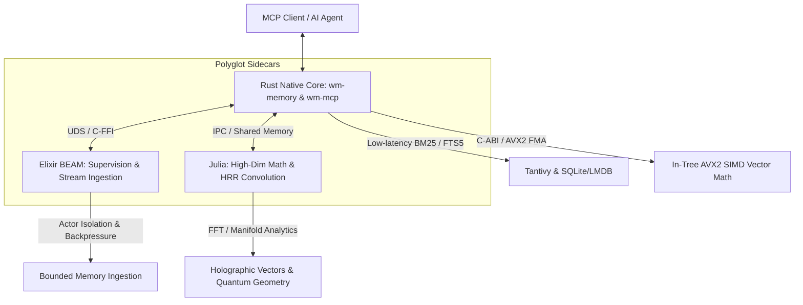

# Polyglot Core & SIMD Acceleration Strategy for Whitemagic v6

**Date:** 2026-08-20  
**Target Platform:** x86_64 / Linux (optimized for modest CPU hardware like ThinkPad T480s — 4C/8T, 16GB RAM)  
**Status:** Architectural Blueprint & Future Work Plan  

---

## 1. Executive Summary

During LongMemEval-S benchmark iterations, pure deterministic retrieval in Whitemagic (BM25, Tantivy, composite sliding windows) executed 50 questions in under a minute with tiny memory footprints. However, adding FP32 local ONNX embedding inference caused 100% CPU core saturation, memory arena fragmentation, and severe swap thrashing leading to an out-of-memory crash.

This document outlines a dual strategy:
1. **Immediate Rust SIMD & Model Hardening:** Re-integrate native AVX2 kernels and INT8 quantized embeddings (`BGESmallENV15Q` / `AllMiniLML6V2Q`) with bounded thread pools.
2. **Secondary Polyglot Core Architecture:** Reintroduce specialized polyglot sidecars (Elixir for actor supervision/stream throttling, Julia for heavy mathematical/manifold tensor operations) inspired by earlier Whitemagic designs.

---

## 2. Polyglot Language Roles & Synergy

### A. Elixir (BEAM Concurrency & Memory Supervision)
* **Historical Role (`polyglot/elixir/lib`):**
  * `actor_supervisor.ex`: OTP supervisor trees isolating memory nodes into independent BEAM processes.
  * `galaxy_replication.ex` & `galaxy_discovery.ex`: Distributed clustering and event distribution.
  * `holographic_memory.ex`: GenServer holding state without global locks.
* **v6 Target Utility:**
  * **Stream Backpressure & Rate Limiting:** Prevent batch-ingestion surges from flooding the heap by buffering items through GenStage/Broadway pipelines.
  * **Per-Process Heap Isolation:** If an analytical task experiences memory growth, the BEAM per-process garbage collector reclaims memory instantly without global stop-the-world pauses.
  * **Crash Isolation:** A failing query or embedding worker crashes only its local actor and is restarted cleanly by OTP supervisors.

### B. Julia (High-Dimensional Numerical & Mathematical Geometry)
* **Historical Role (`polyglot/whitemagic-jl/src`):**
  * `HolographicMemory.jl`: Vector superposition, circular convolution via FFT, clean cosine retrieval.
  * `QuantumGeometry.jl` & `GalaxyComparison.jl`: Manifold distance calculations and topological geometry.
  * `cache_analytics.jl` & `YieldCurve.jl`: Vectorized statistical time-series forecasting.
* **v6 Target Utility:**
  * **Zero-Overhead Linear Algebra:** Julia’s LLVM-JIT compiles native SIMD/AVX array operations (`LoopVectorization.jl`) that run at C speeds.
  * **FFT-Accelerated Holographic Memory (HRR):** Offload $\mathcal{O}(D \log D)$ circular convolutions for associative memory binding.
  * **Offline Batch Analytics:** Perform heavy clustering, manifold dimensionality reduction, and PCA on memory topologies asynchronously.

---

## 3. Immediate Rust SIMD & Embedding Enhancements for v6

Before spawning secondary runtimes, current v6 memory paths can be optimized with zero additional dependencies:

### 1. Re-integrate AVX2 Dot Products in `wm-memory`
Port the proven AVX2 batch kernels from `WHITEMAGIC/core/whitemagic/core/acceleration/embedding_simd.rs`:
* Replace scalar `zip().map().sum()` in `vector.rs` and `episodic.rs` with runtime CPU-detected AVX2 8-lane F32 vector dot products (`batch_cosine_similarity_simd`).
* Target: `<1 µs` per 50-candidate cosine reranking pool.

### 2. Add INT8 Quantized FastEmbed Models
Update `OrtEmbedder::resolve_model` in `crates/wm-memory/src/embedder.rs`:
* Add support for `fastembed::EmbeddingModel::BGESmallENV15Q` and `AllMiniLML6V2Q`.
* **Benefits:**
  * Model weight size drops from **~130 MB $\rightarrow$ ~30 MB**.
  * Memory bandwidth requirements reduced by **75%**.
  * Executes via CPU INT8 SIMD instructions, preventing thermal throttling.

### 3. Constrain Threading Defaults
* Update `OrtEmbedder::from_env` to clamp `WM_EMBEDDER_ORT_THREADS` to `min(physical_cores, 4)` rather than total logical threads (8).
* Eliminates hyperthread contention on physical ALUs and prevents glibc allocator fragmentation.

### 4. Benchmark Process Lifecycle & Storage Isolation
* Update `longmemeval_bench.py`:
  * Ensure temporary SQLite/LMDB databases are vacuumed or reset between benchmark batches.
  * Implement periodic batch garbage-collection in long-running persistent servers.

---

## 4. Implementation Roadmap

| Phase | Milestone | Focus Areas |
| :--- | :--- | :--- |
| **Phase 1** | **Rust Core SIMD & Quantization** | • Integrate AVX2 dot-product kernels into `wm-memory` • Wire `BGESmallENV15Q` and `AllMiniLML6V2Q` in `OrtEmbedder` • Default threads to physical core count |
| **Phase 2** | **Benchmarking & Storage Pruning** | • Validate 50q LongMemEval-S with INT8 embeddings on ThinkPad T480s • Verify 0% swap activity and sub-minute execution |
| **Phase 3** | **Elixir Ingestion Supervisor** | • Re-establish lightweight Unix Domain Socket (UDS) / C-Node bridge to Elixir • GenStage backpressure for bulk memory creation |
| **Phase 4** | **Julia Mathematical Accelerator** | • Connect Julia daemon for FFT-based HRR convolution and geometric clustering |
