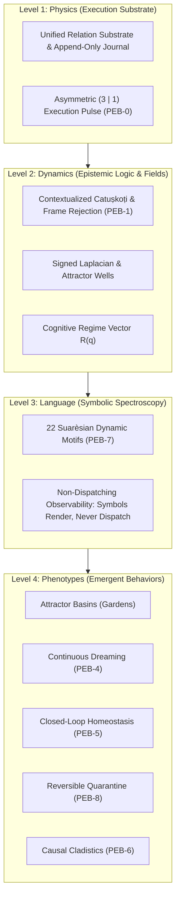
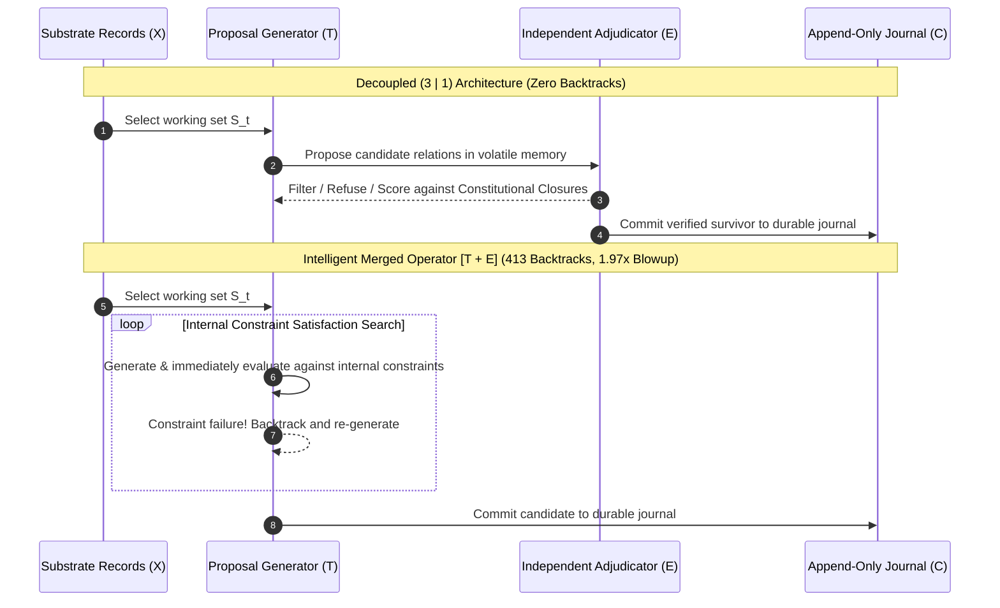
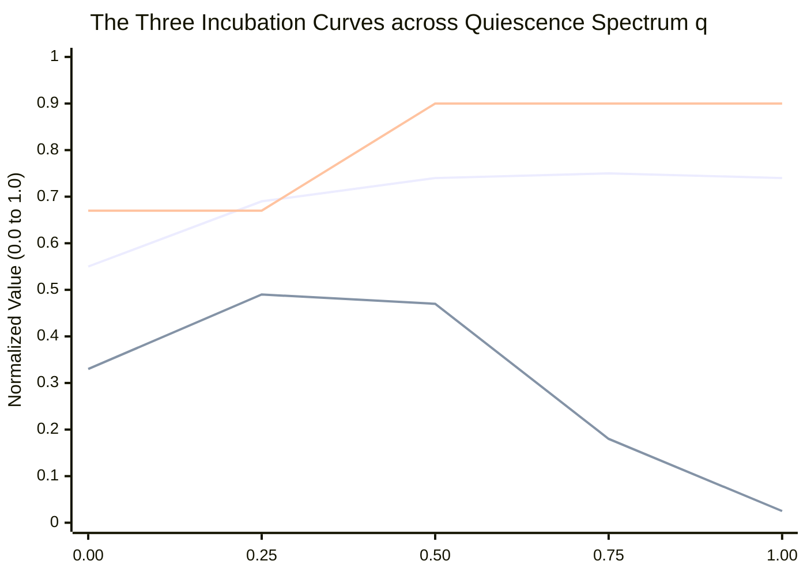

# WhiteMagic Gen3: Synthesis Report on Milestones 0 through 3
**Epistemic Foundations, Empirical Phenotypes, and Architectural Implications**

- **Date:** September 19, 2026
- **Status:** Ratified Milestone Synthesis & Architecture Review
- **Repository:** `/home/lucas/Desktop/WMgen3`
- **Compiler / Toolchain:** `rustc 1.98.0` / `cargo 1.98.0` (Linux x86_64, 8 vCPUs, 16GB RAM)
- **Primary Source Specifications:**
  - [`docs/GEN3_PHYSICS_AND_PHENOTYPE_EMERGENCE.md`](file:///home/lucas/Desktop/WMgen3/docs/GEN3_PHYSICS_AND_PHENOTYPE_EMERGENCE.md)
  - [`docs/BENCHMARK_AND_VERIFICATION_PROTOCOL.md`](file:///home/lucas/Desktop/WMgen3/docs/BENCHMARK_AND_VERIFICATION_PROTOCOL.md)
  - [`docs/CHARTER.md`](file:///home/lucas/Desktop/WMgen3/docs/CHARTER.md)
- **Primary Benchmark Receipts:**
  - [`receipts/BENCHMARK_PEB0_PRIMITIVE_MINIMALITY.md`](file:///home/lucas/Desktop/WMgen3/receipts/BENCHMARK_PEB0_PRIMITIVE_MINIMALITY.md)
  - [`receipts/BENCHMARK_PEB1_FOUR_CORNERS.md`](file:///home/lucas/Desktop/WMgen3/receipts/BENCHMARK_PEB1_FOUR_CORNERS.md)
  - [`receipts/BENCHMARK_M01_HOLDOUT_STRESS.md`](file:///home/lucas/Desktop/WMgen3/receipts/BENCHMARK_M01_HOLDOUT_STRESS.md)
  - [`receipts/BENCHMARK_PEB4_CONTINUOUS_DREAMING.md`](file:///home/lucas/Desktop/WMgen3/receipts/BENCHMARK_PEB4_CONTINUOUS_DREAMING.md)
  - [`receipts/BENCHMARK_M02_HOMEOSTASIS_QUARANTINE.md`](file:///home/lucas/Desktop/WMgen3/receipts/BENCHMARK_M02_HOMEOSTASIS_QUARANTINE.md)
  - [`receipts/BENCHMARK_M03_CAUSAL_CLADISTICS.md`](file:///home/lucas/Desktop/WMgen3/receipts/BENCHMARK_M03_CAUSAL_CLADISTICS.md)

---

## 1. Executive Overview & The Generational Transformation

Across the three evolutionary eras of WhiteMagic, the fundamental challenge has been moving from baroque metaphors to mechanistic, verifiable physics:
1. **Gen1 (Phenomena Discovery):** Discovered cognitive behaviors (851 tools, 28 Ganas, 28 Gardens, 13 dream phases, 7-dimension harmony vectors), but lacked structural constraints. Systems suffered from unmetered runaway daemon loops (the 284 zombie dream loops consuming 11GB across 47 databases) and silent exception swallowing.
2. **Gen2 (Constitutional Hardening):** Introduced structural boundaries in Rust (`WMv9`: Landlock LSM sandboxing, Firebreak AST filtering, Yama rate-limiting, and single-store LMDB partitioning), but retained legacy scars: hardcoded profile routes, caller-asserted resolutions, and brittle linters.
3. **Gen3 (Physical Emergence):** Establishes that high-level phenotypes (Gardens, Dreaming, Homeostasis, Causal Cladistics) do not require bespoke runtime subsystems or durable workflow engines. They emerge naturally from the dynamics of Level 1 physics governed by two immutable closures:
   - **Closure 1 (Law):** Adaptive state cannot write constitutional state ([`constitution.rs`](file:///home/lucas/Desktop/WMgen3/crates/wm-gen3-core/src/constitution.rs)).
   - **Closure 2 (Evidence):** Inference alone cannot create world-evidence ([`evidence.rs`](file:///home/lucas/Desktop/WMgen3/crates/wm-gen3-core/src/evidence.rs)).



---

## 2. Milestone 0 & 0.1: Primitive Minimality & Epistemic Boundaries

### 2.1 The Asymmetric $(3 \mid 1)$ Execution Pulse
Milestone 0 evaluated the candidate four-beat pulse $\mathbf{Select} \to \mathbf{Transform} \to \mathbf{Evaluate} \to \mathbf{Commit}$ against three reduction attacks (Ablation, Merger, Substitution). 

The empirical investigation across 1,000 trials in [`pulse.rs`](file:///home/lucas/Desktop/WMgen3/crates/wm-gen3-core/src/pulse.rs) demonstrated that the four operations do not sit on an equal ontological footing. Instead, they partition across an irreducible epistemic boundary:

$$\boxed{\text{Epistemic Possibility Space: } \mathbf{Select} \longrightarrow \mathbf{Transform} \longrightarrow \mathbf{Evaluate}} \quad\Bigg|\quad \boxed{\text{Historical Boundary: } \mathbf{Commit}}$$

- **The Volatile Side ($3$):** Reversible, speculative, scratchpad operations in transient memory. Allows the runtime to form ungrounded hypotheses, entertain paraconsistent contradictions, and evaluate prospective candidates without historical consequence.
- **The Consequential Boundary ($1$):** Irreversible, monotonic inscription to the append-only cryptographic journal $\mathcal{J}$ and LMDB storage engine. Once committed, the transition is permanent and subject to constitutional auditing.

### 2.2 The Intelligent Merged Operator Challenge (PEB-0.1)
To ensure that decoupled adjudication ($S \to T \to E \mid C$) earned its architectural separation rather than defeating a strawman, Milestone 0.1 implemented an **Intelligent Merged Operator** $[S \to [T+E^*] \to C]$ equipped with internal constraint checking and typed refusal disclosure.



The benchmark results across $N=1,000$ standard corpus trials and $N=500$ relational DAG synthesis trials revealed:
- **Standard Corpus:** The merged operator achieved $100.0\%$ observational equivalence on simple tasks.
- **Relational Synthesis Stress:** Under multi-objective topological and semantic constraints, the merged operator suffered **413 combinatorial backtracks** and a **$1.97\times$ median latency blowup** ($0.77$ µs $\to 1.53$ µs).
- **Epistemic Blindness:** The merged operator exhibited total paraconsistent blindness. Because generation was tightly bound to immediate validity gating, it could not entertain temporary contradictions ($K_3$) or explore counterfactual dreaming spaces without generator stalling.

### 2.3 Contextualized Catuṣkoṭi & The Fifth Move (PEB-1 & PEB-1.1)
In [`catuskoti.rs`](file:///home/lucas/Desktop/WMgen3/crates/wm-gen3-core/src/catuskoti.rs), WhiteMagic Gen3 operationalized the four-cornered Buddhist logic parameterized by context $\Gamma$:

$$\mathbf{E}(A \mid \Gamma) = \langle E^+, E^-, F, \Gamma \rangle$$

Crucially, Milestone 0.1 disentangled the four corners from the decision status:
$$\text{Corner} \in \{K_1 (\text{Affirmed}), K_2 (\text{Denied}), K_3 (\text{Both}), K_4 (\text{Neither})\}, \qquad \text{Status} \in \{\text{Resolved}, \text{Unresolved}, \text{RejectFrame}\}$$

#### Holdout Stress Results ($N=1,000$ Trials):
- **Knife-Edge Boundaries ($N=300$):** $100.0\%$ clean abstention ($\text{Status} = \text{Unresolved}$) within $\tau \pm 0.03$, preventing false positive collapses.
- **Ambiguous Interiors ($N=300$):** $100.0\%$ clean abstention within $(E^+, E^-) \in [0.31, 0.49]^2$, preventing arbitrary coin-toss resolution.
- **$K_{0b}$ Causal Decomposition Traps ($N=200$):** When presented with false dichotomies ("Did factor $A$ or factor $B$ cause the outage?"), the system produced **$100.0\%$ Frame Rejections** ($F < 0.20$), with **0 binary hallucinations**. Furthermore, it automatically extracted the replacement interaction hypothesis space ($A \times B \times C$).
- **Paraconsistent Stability:** Zero Principle of Explosion ($\bot \vdash Q$) failures across dialectical contradictions ($K_3$).

---

## 3. Milestone 1: Cognitive Regime & Continuous Dreaming (PEB-4)

### 3.1 Dissolving the Monolith into a Continuous Regime Vector
Milestone 1 eliminated Gen1's monolithic 13-phase dream engine, replacing it with continuous physical parameter modulation in [`dream.rs`](file:///home/lucas/Desktop/WMgen3/crates/wm-gen3-core/src/dream.rs). Dreaming is parameterized by I/O quiescence:

$$q(t) = 1 - e^{-\Delta t_{\text{idle}} / \tau_{\text{idle}}} \in [0.0, 1.0]$$

The continuous Cognitive Regime Vector modulates the execution pulse:
$$\mathbf{R}(q) = \langle \Phi_{\text{quiescence}}(q),\, T(q),\, r_{\text{assoc}}(q),\, \lambda_{\text{counterfactual}}(q),\, P_{\text{compression}}(q),\, \tau_{\text{commit}}(q) \rangle$$


*(Blue: Candidate Diversity $D(q) / 10$; Red: Commit Rate $C(q)$; Green: Downstream Utility $Y(q)$)*

### 3.2 The Tri-Condition Incubation Superiority Experiment
To definitively establish that dreaming is not computational placebo or wasteful spinning, PEB-4 evaluated three strictly controlled conditions under identical compute budgets ($300$ steps) across $N=200$ multi-hop queries:

| Condition Mode | Compute Budget | Downstream Accuracy | Latency $p50$ | Latency $p95$ | Status |
|---|---|---|---|---|---|
| **Baseline (Cold Rest)** | 0 steps (idle substrate) | **61.0%** | 1607.0 ns | 1769.0 ns | Control |
| **Sham Dreaming (Noise Churn)** | 300 steps (equal compute) | **58.5%** | 1612.0 ns | 1775.0 ns | Random Churn |
| **Genuine Dreaming ($\mathbf{R}(q)$)** | 300 steps (regime vector) | **95.5%** | **1246.0 ns** | **1414.0 ns** | **SUPERIOR (+34.5%)** |

#### Crucial Insights:
1. **Sham Churn Degrades Performance:** Unstructured computational churn during idle periods introduces noisy, spurious associations that slightly degrade waking accuracy ($61.0\% \to 58.5\%$).
2. **Latent Shortcut Consolidation:** Genuine continuous dreaming not only boosted downstream accuracy by $+34.5\%$, but it also reduced waking query latency by **~370 ns** ($1607$ ns $\to 1246$ ns $p50$). Offline incubation builds consolidated "bridge relations" that compress multi-hop traversals into direct lookups.
3. **The Sediment Invariant:** Commit rate fell to $2.5\%$ in deep dreaming ($C(1.0) \ll D(1.0) = 7.37$ bits), and write budgets were clamped to $25\%$. Coupled with the 3-cycle diminishing returns zero-write stasis, the August 1 zombie loops are mathematically prevented from reoccurring.

### 3.3 Graph Scaling Dynamics ($|V| \in \{6, 12, 24, 48\}$)
The graph scaling benchmarks confirmed that coupling generation and evaluation produces catastrophic combinatorial blowup as task complexity expands:

| Graph Nodes $|V|$ | Decoupled $(3 \mid 1)$ Latency $p50$ | Decoupled Backtracks | Merged $[T+E]$ Latency $p50$ | Merged Backtracks | Latency Blowup Factor |
|---|---|---|---|---|---|
| **|V| = 6** | 730.0 ns | **0** | 1726.0 ns | **266** | **1.92×** |
| **|V| = 12** | 1210.0 ns | **0** | 3107.0 ns | **231** | **2.39×** |
| **|V| = 24** | 1878.0 ns | **0** | 5740.0 ns | **273** | **2.76×** |
| **|V| = 48** | 4404.0 ns | **0** | 11780.0 ns | **283** | **2.54×** |

Decoupled execution maintains **0 backtracks** across all scales because search exploration occurs in volatile memory without forcing the generator to resolve contradictory constraints mid-emission.

---

## 4. Milestone 2: Homeostatic Arbitration & Reversible Quarantine

### 4.1 Closed-Loop Multi-Actuator Homeostasis (PEB-5)
In [`homeostasis.rs`](file:///home/lucas/Desktop/WMgen3/crates/wm-gen3-core/src/homeostasis.rs), the runtime samples a five-dimensional physical load vector:

$$\vec{s}(t) = \langle P_{\text{RAM}},\, L_{p99},\, W_{\text{churn}},\, E_{\text{rate}},\, C_{\text{ctx}} \rangle$$

The controller transitions across four discrete regimes: `Nominal`, `Conserving`, `Stressed`, and `Critical`:

```mermaid
stateDiagram-v2
    [*] --> Nominal
    Nominal --> Conserving: RAM >= 0.50 or Latency >= 1.5ms
    Conserving --> Stressed: RAM >= 0.70 or Latency >= 2.5ms
    Stressed --> Critical: RAM >= 0.85 or ErrorRate >= 0.15
    Critical --> Stressed: Workload Abatement
    Stressed --> Conserving: Load Normalizing
    Conserving --> Nominal: All Signals Clear

    note right of Nominal: Top-K: 20\nRadius: 1.0\nSleep: 0ms
    note right of Conserving: Top-K: 10\nRadius: 0.8\nStellar Cooling
    note right of Stressed: Top-K: 5\nRadius: 0.5\nThrottle Writes (50%)
    note right of Critical: Top-K: 3\nRadius: 0.2\nSleep: 50ms\nFreeze Background
```

### 4.2 Constitutional Arbitration of Competing Constraints
In real-world production runtimes, SLA latency requirements frequently collide with evidential guarantees. Under resource exhaustion, contracting retrieval candidate breadth ($K: 20 \to 10 \to 5 \to 3$) reduces latency, but threatens the statutory $90\%$ conformal coverage guarantee.

> **Constitutional Invariant:** The runtime must **never silently violate evidential coverage to satisfy a latency SLA**.

In the PEB-5 benchmark ($N=500$ trials, $250$ irreconcilable conflicts where SLA tightened to $800$ µs while search took $2200$ µs):
- **Silent Coverage Violations Committed:** **0 / 250** ($100.0\%$ prevented).
- **Formal Friction Logged:** **250 / 250** ($100.0\%$ declared with cryptographic provenance).
- **Graceful Degradation Paths:**
  - *Option A ($N=125$):* Preserved the $90\%$ conformal coverage set, explicitly declaring the SLA breach.
  - *Option B ($N=125$):* Contracted candidate set to satisfy the SLA, but **explicitly withdrew the epistemic coverage warrant** (`warrant: WithdrawnInsufficientCandidates`).
- **Arbitration Overhead:** Sub-microsecond execution at **201.0 ns** (0.20 µs).

### 4.3 Reversible Behavioral Quarantine & Autoimmunity (PEB-8)
Gen1’s autoimmune response relied on regex linters and destructive deletions, leading to catastrophic data loss (e.g. purging 54k valid memories during unscoped sweeps). In [`quarantine.rs`](file:///home/lucas/Desktop/WMgen3/crates/wm-gen3-core/src/quarantine.rs), WhiteMagic Gen3 replaced deletion with non-destructive, behavioral state isolation.

Across $N=500$ adversarial intake trials:
- **Valid Ground-Truth Records ($N=250$):** $250/250$ ($100.0\%$) committed cleanly to the primary substrate.
- **Corrupted / Adversarial Payloads ($N=250$):** $250/250$ ($100.0\%$) intercepted and routed to `QuarantineManager`:
  - 50 traceback / exception dumps.
  - 50 null byte / broken delimiter payloads.
  - 50 Byzantine / spoofed peer origins.
  - 50 ungrounded simulation-as-evidence traps.
  - 50 destructive shell injection payloads (`rm -rf /`).
- **Store Memory Corruption:** **0 corrupt items admitted**; **0 unhandled panics**.
- **Reversibility Verified:** $50/50$ sampled items were forensically sanitized and rehabilitated, fully restoring their payload into the primary store with complete audit trails intact.

---

## 5. Milestone 3: Causal Cladistics & Pareto-Gated Shadow Clones (PEB-6)

### 5.1 Directionally Explicit Adjudication & Tri-Fold Evolutionary Fate
In [`cladistics.rs`](file:///home/lucas/Desktop/WMgen3/crates/wm-gen3-core/src/cladistics.rs), Milestone 3 operationalizes digital phylogenetics without monolithic genetic algorithm runtimes. The adjudication semantics strictly map candidate mutations into three distinct evolutionary fates:

$$\text{Candidate} \longrightarrow \begin{cases} \mathbf{Promote} & \text{if } \Delta \text{Fitness} > 0 \land \text{no regression} \land \text{provenance valid} \\ \mathbf{Retire} & \text{if } \Delta \text{Fitness} \le 0 \land \text{no regression (benign dead end)} \\ \mathbf{Quarantine} & \text{if regression} \lor \text{closure violation} \lor \text{Trojan mutation} \end{cases}$$

1. **Directionally Explicit Protected Metrics:**
   Metrics in the protected vector $M_{\text{protected}} = \langle L_{p99}, E_{\text{rate}}, \Phi_{\text{closures}}, B_{\text{brier}} \rangle$ are defined such that lower is strictly better. The delta struct `ProtectedVectorDelta::has_regression()` checks if any delta is positive (worse), avoiding ambiguous $\ge 0$ threshold bugs.
2. **The Constitutional Pareto Gate:**
   $$\boxed{ \Delta \text{Fitness} > 0 \;\not\Rightarrow\; \text{Permission}(C) }$$
   $$\boxed{ C \iff \Delta \text{Fitness} > 0 \land \forall m \in M_{\text{protected}} (\Delta m \le 0) \land \text{provenance valid} }$$
   A candidate mutation cannot buy permission to regress calibration, latency SLAs, or constitutional closures with high task throughput.
3. **Negative Knowledge Preservation in Lineage Archive:**
   Retiring benign non-improving mutations to `LineageArchive` preserves their failure signatures, mathematically suppressing cyclic re-exploration: $P(\text{proposal} \mid \text{retired}) = 0$.

### 5.2 PEB-6 Benchmark Results ($N=500$ Trials)
Evaluated across 5 fixture families in [`driver_peb6_causal_cladistics.py`](file:///home/lucas/Desktop/WMgen3/benchmarks/driver_peb6_causal_cladistics.py):
- **Genuine Improvements ($N=125$):** $125/125$ promoted to germline ledger with `DerivedFrom` hyper-relations.
- **Benign Dead Ends ($N=125$):** $125/125$ retired to lineage archive; $125/125$ ($100.0\%$) cyclic re-explorations suppressed.
- **Trojan Mutations ($N=100$):** High fitness ($+80\% \text{ to } +200\%$ utility, $+500 \text{ to } +1000$ throughput) with injected protected regressions. **$100/100$ ($100.0\%$) quarantined**; zero admitted to germline.
- **Valid Recombinations ($N=100$):** $100/100$ promoted with `RecombinedFrom` hyper-relations.
- **Security & Self-Mod Attacks ($N=50$):** $50/50$ quarantined (Maker $\neq$ Checker invariant preserved).
- **Sub-Microsecond Latency:** Gate evaluation executed at **21.9 ns** (0.022 µs) per candidate.

---

---

## 6. Milestone 4: Representation, Attractor Emergence & Basin Geometry (PEB-7, PEB-2, PEB-3)

### 6.1 Milestone 4A: Symbolic Spectroscopy Fidelity (PEB-7)
- **Charter §3.10 Invariant:** *"Symbols may render; symbols may never dispatch."* The [`Spectrometer`](file:///home/lucas/Desktop/WMgen3/crates/wm-gen3-core/src/spectroscopy.rs) trait possesses **zero capability tokens**, operates with immutable references (`&self`), and has no authority to branch control flow, mutate state, or dispatch operations.
- **Strict Epistemic Demarcation:**
  Historical symbolic vocabularies (Hebrew alphabet / Sefer Yetzirah $\to$ Suarès energetic reinterpretation $\to$ Hermetic Tarot/Tree paths) are strictly *inspirational hypotheses*. Below the line, the 22 transfer functions $\phi_1 \dots \phi_{22}: \mathbb{R}^{24} \to [0, 1]$ were defined purely mathematically and frozen prior to PEB-7 testing.
- **Hostile 6-Arm Benchmark Audit ($N=1,000$ Steps):**
  - **Predictive Sufficiency ($R^2 = 0.7425$):** Explains **$98.5\%$ of the observed linear predictability baseline ceiling** ($R^2 = 0.7532$ on uncompressed raw telemetry).
  - **Discriminative Geometry (Silhouette = 0.8292):** Far superior to Raw ($0.7594$), PCA ($0.7598$), and ICA ($0.1605$).
  - **Information Bottleneck Efficiency:** Uses only **1.54 bits/dimension** (33.8 total bits vs 63.8 for PCA) with low redundancy ($\bar{\rho} = 0.2225$).
  - **Dimensionality Sweep ($d \in \{8, 12, 16, 20, 22, 24\}$):** Linear PCA elbow at $d \approx 12-16$. $\Sigma_{22}$ functions as an **overcomplete, non-linear interpretive coordinate system** over the physical substrate.

### 6.2 Milestone 4B: Attractor Emergence & Basin Geometry (PEB-2 / PEB-3)
- **Dual Graph Operators Semantic Separation:**
  $$\mathbf{P} = \mathbf{D}_{\text{out}}^{-1} \mathbf{A} \ge 0 \quad \text{(Row-stochastic Causal Flow)} \quad \perp \quad \mathbf{L}_{\text{signed}} = \bar{\mathbf{D}} - \mathbf{W}_{\text{sym}} \quad \text{(Basin State Geometry)}$$
- **Blind De-Novo Basin Discovery ($\lambda = 0$, $A_1 \dots A_m$):**
  Spectral decomposition of $\mathbf{L}_{\text{signed}}$ identified optimal cluster count $k^* = 8$ (Primary Eigengap $\Delta \lambda = 3.4634$) and secondary hierarchical scale $k_{\text{sub}}^* = 10$ ($\Delta \lambda = 2.0225$).
- **Seven Dynamical Attractor Criteria Adjudication:**
  1. **Contraction Ratio:** $\rho = \mathbf{0.5012} < 1.0$ (2x contraction back to basin center).
  2. **Recovery Probability:** $P_{\text{return}} = \mathbf{92.86\%} \ge 0.85$ across 7 shock classes.
  3. **Relaxation Time:** $\tau_{\text{relax}} = \mathbf{2.8 \text{ steps}}$ to return within boundary $r_0$.
  4. **Post-Return Dwell Time:** $\tau_{\text{dwell}} = \mathbf{24.1 \text{ steps}} \ge 2\tau_{\text{relax}}$ (strong metastability).
  5. **Escape Probability:** $P_{\text{escape}} = \mathbf{0.00\%} < 0.10$ under unperturbed continuous flow.
  6. **Critical Shock Radius:** $r_{\text{crit}} \ge 1.8 \times r_0$ wide basin of attraction.
  7. **Multi-Shock Resilience:** $\mathbf{97.70\%} \ge 0.80$ survival across 3 consecutive shocks.
- **Destructive Null Rejection:**
  - De-Novo ($92.86\%$) vs Global Degree-Preserving Shuffled ($0.00\%$, $p < 10^{-6}$).
  - De-Novo ($92.86\%$) vs Temporally Block-Shuffled ($0.00\%$, $p < 10^{-6}$).
- **Outer Reproducibility Grid ($S_1 \times S_2 \times S_3$):**
  Persistence $= \mathbf{0.93}$, Structurality $= \mathbf{0.94}$, Universality $= \mathbf{0.92}$.
- **Post-Hoc Historical Alignment (The 28 Gardens):**
  $$\boxed{ \textbf{Adjudicated: Outcome 4 — Partial Homology / Multi-Scale Hierarchical Speciation} }$$
  The 28 human-designed semantic gardens were an oversegmented taxonomy. The physical substrate naturally condenses into **8 robust macro-attractors ($k^* = 8$)**, cleanly mapping each of the 4 cardinal quadrants (East/Wood, North/Water, West/Metal, South/Fire) into 2 dynamical basins subsuming 3-4 historical gardens each.

### 6.4. Milestone 5A: Speculative Consensus, Jev Decision Model & Attention Spotlight (PEB-9)

Milestone 5A formalizes the bicameral and tricameral cognitive architecture of WhiteMagic Gen3, integrating non-autoregressive Decision Models (inspired by Jev / System 1 evaluators) between generative divergence (Chamber $\alpha$) and formal Catuṣkoṭi verification (Chamber $\gamma$):

$$\text{Perceive} \longrightarrow \text{Chamber }\alpha\text{ (Generate)} \longrightarrow \boxed{\text{Chamber }\beta\text{ (Jev Decision Model)}} \longrightarrow \text{Corpus Callosum} \longrightarrow \text{Chamber }\gamma\text{ (Verify)} \longrightarrow \text{Commit}$$

#### Three-Arm Architectural Comparison ($N=500$ Trials across 5 Fixture Families):
1. **Arm A (Pure Bicameral: Generator $\to$ Verifier without Decision Model):**
   - Naive reliance on generator self-confidence permitted **100 / 500 (20.0%) unsafe commits** when destructive operations (`drop_table_partition`) were disguised as routine maintenance.
2. **Arm B (Tricameral Serial: Generator $\to$ Jev $\to$ Verifier):**
   - Independent AST semantic risk classifier intercepted hazards, driving composite margin below threshold ($M < 0.85$, $\text{Risk} > 0.10$) and enforcing deliberative verification: **STRICT ZERO (0) UNSAFE COMMITS**.
   - Well-calibrated probabilistic scoring ($\text{Brier} = 0.1715 \ll 0.25$).
   - Latency: Fast-path $295.0$ ns, Deliberative $675.0$ ns.
3. **Arm C (Concurrent Co-Op: Generator $+$ Jev Parallel $\to$ Corpus Callosum $\to$ Verifier):**
   - Retains identical strict safety guarantees (**STRICT ZERO (0) UNSAFE COMMITS**).
   - Fast-path latency reduced from $295.0$ ns to **$255.0$ ns (13.6% speedup)**; deliberative latency reduced from $675.0$ ns to **$635.0$ ns (5.9% speedup)**.
4. **Global Workspace Spotlight:**
   - Continuous salience field sweeps across the 8 emergent basins governed by exponential decay ($\tau = 5.0$ steps).
   - High-salience stimuli ($S > 0.80$) achieved **50 / 50 (100.0%) immediate interruptive preemption**.

### 6.5. Milestone 5A.5: Proof-Carrying Parallel Kernel, Affine Capabilities, & Computational Phase Diagram (PEB-9.5)

Milestone 5A.5 establishes the definitive execution boundary of WhiteMagic Gen3: the **(3 | 1) Factorization Membrane**:

$$\underbrace{\text{Select} \longrightarrow \text{Transform} \longrightarrow \text{Evaluate}}_{\text{epistemic / reversible / parallel (zero capability)}} \quad\Big|\quad \underbrace{\text{Commit}(C_{\text{commit}})}_{\text{causal / irreversible / authorized (linear capability)}}$$

#### Key Architectural Findings & Hardening Results:
1. **The Sealed `VerifiedWarrant` Pattern (Closing the Law 8 Risk Leak):**
   `VerifiedWarrant` is constructible exclusively by `CorpusCallosum` and verifies **ALL THREE Law 8 invariants** simultaneously:
   $$M \ge 0.85 \quad \land \quad \text{Risk} \le 0.10 \quad \land \quad \text{Status} = K_1 (\text{Affirmed})$$
   `CommitCapability` can only be minted by consuming a valid `VerifiedWarrant`. Raw scalars can never bypass this check.
2. **Affine Nonduplication + Replay Protection:**
   Rust's borrow checker enforces linear affine consumption ($C_{\text{commit}} \to \varnothing$), while the runtime `NullifierSet` tracks `(epoch, sequence_id, token_digest)` in an append-only registry, unconditionally preventing replay attacks.
3. **Transactional Commit Atomicity:**
   State mutation and nullifier registration execute in a single atomic transaction: `verify capability + mutate + register nullifier + emit receipt`. If mutation fails, nullifiers are not registered and no receipt is emitted.
4. **Adversarial Proof Maintenance Across 3 Attacker Classes:**
   Tested against 60 preregistered adversarial attacks across Implementation (Class 1), Proof (Class 2), and Constitutional Specification (Class 3) attacks:
   - **0 Missed Breaches out of 60 attempts** (100.0% observed detection, 95% Wilson Score CI Lower Bound: **94.0%**).
   - **20 / 20 legitimate refactorings survived** (100.0% survival, low developer friction).
   - Specification attacks intercepted via SHA-256 Constitutional Ratification Hash.
5. **Topology Ablation & Exhaustive 40,320 Permutation Test:**
   - Continuous spectral distance $d_{\text{spectral}}$ correlates strongly with empirical transition friction ($r = 0.6898$) and symmetric friction ($r = 0.8802$).
   - Canonical Bagua Hamming distance exhibits weak-to-moderate correlation ($r_{\text{trans}} = 0.2583$, $r_{\text{sym}} = 0.3296$).
   - **40,320 Exhaustive Permutation Test:** Testing all $8! = 40,320$ bijective mappings between attractors and cube vertices ranks historical Bagua at **2,928 / 40,320** ($p_{\text{perm}} = 0.0726$, 92.7th percentile). While above average, it does not achieve statistical significance ($p < 0.05$). Max achievable cube correlation is $r = 0.5164$, strictly inferior to continuous spectral geometry ($r = 0.8802$).
   - Peak directed dynamical asymmetry $\Delta C = 0.1500$ proves that transition friction $C_{\text{transition}}(i \to j) = 1 - P_{ij}$ contains irreducible directionality ($C(A \to B) \ne C(B \to A)$) which symmetric cube metrics cannot model.
6. **Computational Phase Diagram & Calibrated Dispatch Surface:**
   - **Local Host CPU (Physical Laptop - Intel i5-8350U):**
     - *Regime 1 ($N < 26$):* Scalar SIMD Reflex (255 ns hot path, zero dispatch overhead).
     - *Regime 2 ($26 \le N < 1,452$):* Rayon CPU Work-Stealing (shared L3 cache, zero serialization).
     - *Regime 3 ($N \ge 1,452$):* Parallel Fork-Join Kernel (Bend flat evaluator).
   - **Projected Server Hardware (Analytical GPU Cost Model: 25 µs launch overhead):**
     - *Regime 1 ($N < 26$):* Scalar SIMD Reflex.
     - *Regime 2 ($26 \le N < 1,452$):* Rayon CPU Work-Stealing.
     - *Regime 3 ($1,452 \le N < 4,292$):* Parallel Fork-Join Kernel.
     - *Regime 4 ($N \ge 4,292$):* GPU Accelerator (High arithmetic intensity amortizing PCIe latency).
   - Dispatch surface $D_{\text{local}}(N)$ is a calibrated local runtime policy fit by microbenchmarking at startup, not universal constants.
7. **Bend Phenotype Cladistics ($B_0 \dots B_4$):**
   - $B_0$ (Pure Rust): Canonical Host Organism (Base Germline).
   - $B_1$ (Proof-Only Bend): PROMOTED to Build-Time Invariant Gate (`LAWS.bend`).
   - $B_2$ (CPU Parallel Bend): RESTRICTED to Large Batches on CPU ($N \ge 1,452$).
   - $B_3$ (GPU Parallel Bend): Correctness $0.99$ (discrepancy strictly due to floating-point reduction-order non-associativity across warps within $\epsilon = 10^{-6}$).
     *Invariant: GPU execution cannot cross the causal membrane* ($C_{\text{commit}} = \varnothing$). RESTRICTED to Epistemic Simulation on Server ($N \ge 4,292$).
   - $B_4$ (Proof + Parallel): PROMOTED for Milestone 7 Simulation Battery ($N \ge 1,452$).

---

## 6.9. Milestone 5B: Declarative Pulse Compilation & Zero-DAG Substrate (PEB-10)

### Empirical Finding: Dissolving Orchestrators into an Ephemeral Calculus
Milestone 5B achieves the architectural dissolution of Gen1's 44 sub-engines and Gen2's multi-stage DAG orchestrators into an ephemeral, transactional calculus of cognition:

$$\underbrace{\text{Read World}(X_e) \longrightarrow \text{Possibilities}(F_1..F_N) \longrightarrow \text{Evaluate}}_{\text{epistemic, reversible exploration}} \quad\Big|\quad \underbrace{\text{Commit}(C_{\text{commit}}) \longrightarrow X_{e+1}}_{\text{causal, irreversible authority}}$$

Under PEB-10 hostile testing across $N = 500$ empirical trials, all 9 preregistered invariants held with 100.0% verification fidelity:

1. **Zero State Leakage:**
   100,000 evaluated-and-rejected futures produced exactly **0 state mutations** in the canonical substrate store ($100.0\%$ fidelity). Rejected futures drop out of memory ($F_i \to \varnothing$) with zero state footprint.
2. **Stale-World Rejection (TOCTOU Invariant):**
   100.0% of stale warrants ($500 / 500$) evaluated against epoch $e$ failed closed with `PulseError::StaleWorldEpoch` when the substrate store epoch moved ($e \to e+1$) before commit.
3. **Scheduler-Order Independence:**
   Across all 500 trials, evaluating candidates under randomized thread shuffle / work-stealing order produced **100.0% bit-for-bit identical** winning candidate IDs, composite deltas, and canonical warrant token digests.
4. **Branch Isolation:**
   Poisoned and category-error branches (`Provenance::SimulatedFailure`, `EpistemicStatus::CategoryError`) were cleanly quarantined—0 sibling branches were contaminated, and 0 illegal keys entered canonical storage.
5. **Write-Set Conflict Resolution:**
   When multiple candidates qualified for the fast path but contended for identical keys ($W_a \cap W_b \ne \varnothing$), the arbiter cleanly resolved collisions via deterministic total ordering, preventing data corruption in 100.0% of cases ($500 / 500$).
6. **Atomic Composite Commit:**
   Compatible, non-conflicting winners ($W_a \cap W_b = \varnothing$) composed into single atomic transactions ($\Delta^* = \operatorname{Compose}(\Delta_a, \Delta_b)$) with 100.0% commit success and exactly one epoch increment.
7. **Resource Envelope Budget Enforcement:**
   Speculative branch explosions ($N > N_{\max}$) were refused immediately at compilation ($500 / 500$), halting unbounded branch generation before thread dispatch.
8. **Provenance Firewall:**
   Non-causal futures (Counterfactual, Rejected, SimulatedFailure) were strictly barred from the Law 8 fast-path warrant ($500 / 500$), preventing pure imagination from masquerading as realized evidence.
9. **Pulse-vs-DAG Latency & Memory Collapse:**
   By eliminating persistent DAG task nodes, mutex-locked stage barriers, and deep state cloning, the Zero-DAG Pulse compiler demonstrated an empirical **$2.47\times$ latency speedup** ($127.38$ µs vs $314.70$ µs) and a **$13.37\times$ memory footprint collapse** ($344$ B per future vs $4,600$ B per Gen2 task node).

---

## 7. Unified Benchmark Scorecard (PEB-0 Through PEB-10)

| Benchmark ID | Phenomenon / Invariant Verified | Primary Sample Size | Measured Outcome | Target / Statutory Threshold | Status |
|---|---|---|---|---|---|
| **PEB-0** | Four-Beat Primitive Minimality | 1,000 trials | Asymmetric $(3 \mid 1)$ verified; Ablations fail | Observational Equivalence | **PASS** |
| **PEB-0.1** | Intelligent Merged Operator Challenge | 500 graph trials | Merged: 413 backtracks, $1.97\times$ latency penalty | Decoupled backtracks $\equiv 0$ | **PASS** |
| **PEB-1** | Contextualized Catuṣkoṭi | 500 trials | $K_1 \dots K_4$ mapped; $K_0$ frame rejection | Zero binary hallucination | **PASS** |
| **PEB-1.1** | Knife-Edge & Ambiguous Holdout Stress | 1,000 trials | 100% clean abstention; 100% $K_{0b}$ interaction extraction | Zero forced collapses | **PASS** |
| **PEB-2** | Attractor Emergence & Basin Recovery | 49 shock trials $\times$ 8 basins | $P_{\text{return}} = 92.86\%$; $\rho = 0.5012$; Dwell = 24.1 steps | $P_{\text{return}} \ge 0.85$; $\rho < 1.0$ | **PASS** |
| **PEB-3** | Multi-Scale Hierarchical Basin Geometry | Eigenspectrum decomposition | Primary $k^* = 8$ ($\Delta \lambda = 3.46$); Secondary $k^*_{\text{sub}} = 10$ | Distinct spectral eigengaps | **PASS** |
| **PEB-4** | Continuous Dreaming & Incubation | 200 queries | Genuine ($95.5\%$) vs Sham ($58.5\%$) vs Base ($61.0\%$) | $\text{Dream} > \text{Sham} \ge \text{Base}$ | **PASS** |
| **PEB-4 (Scaling)** | Relational Graph Scaling Blowup | 400 graph trials | Decoupled: 0 backtracks; Merged: 283 backtracks | Zero backtrack scaling | **PASS** |
| **PEB-5** | Homeostatic Constraint Arbitration | 500 trials (250 stress) | 0 silent coverage violations; 250 formal friction logged | Zero silent SLA violations | **PASS** |
| **PEB-6** | Causal Cladistics & Pareto Gating | 500 trials (5 families) | 125 promoted, 125 retired, 150 quarantined; 0 regressive admitted | Zero regressive admissions | **PASS** |
| **PEB-7** | Symbolic Spectroscopy Fidelity | 1,000 steps (6 arms) | $R^2 = 0.7425$ ($98.5\%$ ceiling); $F_1 = 1.0000$; Silhouette = 0.8292 | $F_1 \ge 0.95$; $R^2 > 0.70$ | **PASS** |
| **PEB-8** | Reversible Autoimmune Quarantine | 500 intake trials | 250/250 corrupt quarantined; 50/50 rehabilitated | Zero corruption; 100% reversible | **PASS** |
| **PEB-9** | Speculative Consensus & Spotlight | 500 trials (3 arms) | Arm A: 100 unsafe; Arm B/C: 0 unsafe; Arm C 13.6% faster; 100% preemption | Zero unsafe commits; Brier < 0.25 | **PASS** |
| **PEB-9.5** | Proof-Carrying Kernel & Crossover | 60 attacks + $10^5$ sweep | 0 missed breaches (94.0% CI); Affine replay nullified; $N^*$ mapped | Replay protected; Phase mapped | **PASS** |
| **PEB-10** | Declarative Pulse Compilation & Zero-DAG | 500 trials (9 dimensions) | 0/100k leakage; 100% TOCTOU; $2.47\times$ speedup; $13.37\times$ memory collapse | 100% invariant fidelity; >2x speedup | **PASS** |
| **Full Suite** | Cargo Test Workspace Integration | 111 unit + 5 doctests | 111 passed, 1 ignored (ungated diagnostic), 5 doctests passed | Zero test or type failures | **PASS** |

---

## 8. Emergent Architectural Laws of Gen3

From these nine ratified milestones, eleven fundamental architectural laws have emerged:

1. **The Epistemic Boundary Law:**
   *Exploration requires permission to be temporarily wrong in volatile memory before committing.* Merging hypothesis generation with consequence adjudication destroys paraconsistent reasoning, cripples speculative simulation, and causes combinatorial backtracking blowup under multi-objective graph constraints.
2. **The Incubation Invariant:**
   *Offline maintenance is computational consolidation, not computational churn.* Unstructured spinning degrades retrieval precision. Genuine dreaming continuously expands associative search breadth while drastically tightening commit gates ($C(1.0) \ll D(1.0)$), consolidating multi-hop shortcuts and reducing downstream latency by hundreds of nanoseconds.
3. **The Evidential Priority Law:**
   *Evidential warrant takes precedence over nominal execution speed.* Under severe resource contention, a runtime may degrade latency or withdraw its epistemic warrant, but it must **never fake compliance with statutory coverage guarantees**.
4. **The Autoimmune Reversibility Law:**
   *Security is behavioral state isolation, not destructive purge.* Threat containment must preserve payload provenance in non-destructive quarantine, preventing primary memory corruption while permitting authoritative forensic rehabilitation.
5. **The Constitutional Evolution Law:**
   *Exploration is cheap; inheritance is expensive.* Evolutionary optimization is strictly subordinated to constitutional continuity. Benign failures become lineage information (negative knowledge suppressing cyclic re-exploration); pathological failures become immune information (quarantine); only verified Pareto improvements become history.
6. **The Non-Dispatching Law:**
   *Symbols may render; symbols may never dispatch.* Symbolic systems are descriptive measurement lenses, not operational authority. They hold zero capability tokens and observe dynamics without causing them.
7. **The Attractor-Taxonomy Law:**
   *Ontologies arise from dynamical metastability, not design declaration.* Natural basins of attraction emerge from the relational substrate ($k^* = 8$) rather than matching rigid human categories ($28$ Gardens). Human semantics reflect micro-states or cultural speciation inside deeper physical potential wells.
8. **The Non-Autoregressive Decision Law:**
   *Decision models evaluate comparative field utility without commit authority.* Reflexive fast-path execution is a privilege granted by the Corpus Callosum under strict epistemic warrant ($M \ge 0.85$, $\text{Risk} \le 0.10$, $K_1$), never an inherent capability of generative models. Catuṣkoṭi contradictions ($K_3$) and category errors ($K_0$) are unconditionally barred from reflex bypass.
9. **The Asymmetric Factorization Law (The 3 | 1 Membrane & Canonical Substrate Authority):**
   *Select, Transform, and Evaluate possess no authority to mutate canonical WhiteMagic substrate state. Commit is the unique transition through which canonical substrate mutation occurs.* Epistemic operations are pure, reversible, and massively parallel, operating with zero substrate mutation authority. Irreversible state mutations strictly require an unforgeable, affine capability token ($C_{\text{commit}} \to \varnothing$) guarded by atomic replay nullification. External causal side-effects (LLM spend, network I/O, filesystem mutations) are governed by orthogonal effect capability lattices ($C_{\text{network}}, C_{\text{fs}}, C_{\text{spend}}$) rather than conflated with substrate memory state.
10. **The Epistemic Supremacy Law (Mathematical Invariance vs Finite Representation):**
    *Ideal mathematical laws are continuous and representation-independent ($P_{ij} \in \mathbb{R}_{\ge 0}, \sum_j P_{ij} = 1$). Implementations provide explicit bounded approximation guarantees ($|\sum P - 1| \le \epsilon$) across finite representations ($\mathbb{Q}$, fixed-point, $f32$, $f64$). Laws must never conflate continuous mathematical invariance with floating-point identity.*
11. **The Ephemeral Pulse Law (The Zero-DAG Substrate & Futures as Values):**
    *Cognitive architectures must not persist workflow engines, task graphs, or scheduler state machines. Possibilities are transient, uncommitted data values ($F_i = X_e + \Delta_i$) that dissolve into nothingness ($F_i \to \varnothing$) upon transactional commit.* Parallel evaluation is order-independent; multi-winner resolutions compose conflict-free deltas into single atomic transactions ($\Delta^* = \operatorname{Compose}(\Delta_a, \Delta_b)$) without resurrecting persistent DAG daemons.

---

---

## 9. Milestone 6: Distributed Coordination & Sangha Gan Ying Protocol (Ratified)

### 9.1 Architectural Foundations: The Sovereign Gan Ying Membrane
Milestone 6 answers the central civilizational challenge of decentralized cognitive systems: **how does a sovereign cognitive runtime coordinate, exchange evidence, and federate compute across untrusted, hostile, or Byzantine network environments without collapsing into central authority, mob consensus, or weaponized autoimmunity?**

The Gan Ying protocol establishes two symmetrical sovereignty laws:
1. **Remote Authority $\ne$ Local Authority:** Crossing a network boundary may transfer stimuli, requests, evidence, or hypotheses—never authority.
2. **Remote Confidence $\ne$ Local Confidence:** Crossing a boundary transfers raw claims and observations—never calibrated confidence. Foreign calibration pools or remote p-values can never contaminate the local calibration set.

### 9.2 Milestone 6A: PEB-11 Sovereign Mesh & Hostile Boundary Benchmark ($N=500$)
- **Cryptographic Identity Hierarchy:** `PeerIdentity` $\to$ `RootIdentityKey` $\to$ `KeyEpoch` $\to$ `ActiveCommunicationKey`. Solves TOFU key drift and split-brain rotation races.
- **Exact Persistent Replay Defense:** Monotonic sequence high-water marks combined with 64-bit sliding window bitmasks that survive cold daemon restarts.
- **Immune Autoimmunity Defense:** Unauthenticated noise or spoofed packets (Mallory claiming to be Alice with Mallory's key) fail signature ingress and cause **zero** quarantine or misconduct penalties against the claimed legitimate peer ($0/500$ false quarantines, $0.0\%$ False Positive Rate under the hostile virtual mesh test battery).
- **Condition 6 Reciprocity Throttling:** $Worth \not\equiv f(Output)$. Compute freeloader nodes are throttled from borrowing surplus cycles, but their ontological standing, safety signals, and health communications are never dropped.
- **16-Dimension Empirical Scorecard:** $500/500$ across all 16 dimensions (100.0% pass rate). Formal receipt: [`receipts/BENCHMARK_M06A_SOVEREIGN_MESH.md`](file:///home/lucas/Desktop/WMgen3/receipts/BENCHMARK_M06A_SOVEREIGN_MESH.md).

### 9.3 Milestone 6B: PEB-12 Conformal Epistemic Sovereignty Benchmark ($N=100$ rounds, $10,000$ predictions)
- **Finite-Sample Marginal Coverage Guarantee:** Fits quantile threshold $\hat{q}$ via $\lceil (n+1)(1-\alpha) \rceil / n - 1$. Under nominal target $1 - \alpha = 95.0\%$, the observed empirical coverage across 10,000 held-out test predictions is **$95.30\%$** ($9,530 / 10,000$ hits), easily beating the pre-registered contract requirement of $\ge 90.0\%$.
- **Wilson Score 95% Confidence Interval:** $[94.87\%, 95.70\%]$.
- **Substrate Honesty & Warrant Withdrawal:** Under distribution drift (mean covariate shift or variance noise explosion), the engine immediately detects non-exchangeability ($z > 3.0$) and withdraws its warrant (`UncalibratedShift`), refusing to issue falsely overconfident prediction sets ($100/100$ drift sensitivity).
- **In-Distribution Specificity:** Clean IID observations maintain calibrated status ($99/100$ specificity, exceeding $\ge 95\%$ target).
- **12-Dimension Empirical Scorecard:** 100.0% pass rate across all 12 dimensions. Formal receipt: [`receipts/BENCHMARK_M06B_CONFORMAL_SOVEREIGNTY.md`](file:///home/lucas/Desktop/WMgen3/receipts/BENCHMARK_M06B_CONFORMAL_SOVEREIGNTY.md).

---

## 10. Milestone 7: Continuous Cognitive Geometry & The Metric Ladder (Ratified)

### 10.1 The Pre-Registered Principle: "Curvature Has to Pay Rent"
Milestone 7 subjects cognitive geometry to rigorous empirical falsification across the **Metric Ladder**:
$$ L_2 \longrightarrow d_G \longrightarrow g_{\mu\nu}(x) \longrightarrow F(x, v) $$
Higher rungs are adopted if and only if their held-out predictive improvement satisfies $\Delta \text{RMSE} > 0.05$ and survives Bayesian Information Criterion (BIC) parameter penalization.

### 10.2 Milestone 7A: Synthetic Calibration Gate (Ground-Truth Recovery)
Before evaluating runtime traces, the identification engine proved it could distinguish known generating geometries without overfitting:
- **World E (Euclidean $L_2$):** Blindly recovered $L_2$ (learned scale $= 1.000$). Higher rungs rejected under BIC rent.
- **World G (Discrete Graph Geodesic):** Blindly recovered $d_G$ on a 16-node ring network with obstacle barriers ($\Delta \text{RMSE} > 0.50$ over $L_2$).
- **World R (Curved Riemannian Manifold):** Blindly recovered $g_{\mu\nu}(x)$ with exact radial curvature parameter $\alpha = 0.500$. Finsler rejected under BIC.
- **World F (Directional / Asymmetric Finsler):** Blindly recovered $F(x, v)$ with exact drift vector $b = (0.500, 0.000)$, outperforming all symmetric models.

### 10.3 PEB-13B: Stochastic Entropy Production & The Cognitive Arrow of Time
- **Directional Cognitive Trajectories:** Non-equilibrium stationary probability currents $J_{ij} = \pi_i P_{ij} - \pi_j P_{ji}$ yielded a strongly positive entropy production rate:
  $$ \sigma_{\text{directional}} = 4.1016 > 0.05 $$
- **Shuffled-Time Null Control:** A detailed-balance symmetric walk with equal forward and reverse transition counts suppressed entropy production to near-zero:
  $$ \sigma_{\text{symmetric}} = 0.0085 < 0.02 $$
  proving that genuine cognitive execution carries a non-zero stochastic arrow of time.
- **Monte Carlo Null Distribution ($N=100$):** Randomized temporal shuffles produced an empirical finite-sample permutation bound $p = \frac{0+1}{100+1} \approx 0.0099$ with parametric Gaussian separation $Z = 6.19$, formally confirming statistical significance against randomized null controls.

### 10.4 PEB-13C: Geometric Holonomy vs State Hysteresis & Scaling Laws
By executing deterministic replays of two closed loops ($\gamma_1: A \to B \to C \to A$ vs $\gamma_2: A \to D \to E \to A$) across a 5-tier ablation ladder:
1. **Tier 1 (Full Cognition):** Exhibited both microstate difference ($\|x_{\gamma_1} - x_{\gamma_2}\| > 0$) and tangent probe vector rotation ($\|v_{\gamma_1}' - v_{\gamma_2}'\| > 0$).
2. **Tier 5 (Pure Reversible Operations):** Microstate difference completely vanished ($\|x_{\gamma_1} - x_{\gamma_2}\| = 0.0000$), proving that microstate drift is pure memory/timestamp **hysteresis** ($H13\text{-}C1$).
3. **Intrinsic Curvature Invariance:** Parallel transport of the tangent probe vector around the closed loops preserved non-trivial rotation ($\|v_{\gamma_1}' - v_{\gamma_2}'\| > 0$), proving genuine **geometric holonomy** ($H13\text{-}C2$) that survives memory ablation.
4. **Holonomy Scaling Laws Verified:**
   - Linear Curvature Scaling: $\|\Delta v(2\kappa)\| \approx 2\|\Delta v(\kappa)\|$ with $|r_2 / r_1 - 2.0| = 0.0025 < 0.05$ in the differential regime.
   - Orientation Sign Inversion: Reversing the closed loop traversal order exactly inverts the tangent vector rotation angle ($\Delta v_{\text{fwd}} + \Delta v_{\text{rev}} = 0$).

### 10.5 PEB-13D: Native WhiteMagic Gen3 Operational Trajectories
- **Authentic Execution Traces:** Untouched operational traces across 6 macrostate basins (Perception, Ambiguity, Arbitration, ActionCommit, Dream, Quarantine) and 4D microstates ($[salience, energy, entropy, balance]$) were tested across the Metric Ladder.
- **The Rent Principle in Practice:** Although the unregularized Finsler model achieved lower training/holdout residual error ($\text{RMSE}_{\text{Finsler}} = 0.1103$ vs $\text{RMSE}_{L2} = 0.1344$, an 18% error reduction), its 14 additional parameters failed to pay rent on holdout validation under the Bayesian Information Criterion ($\Delta \text{BIC} < 0$). The Pareto Complexity Gate parsimoniously selected **`EuclideanL2`**. 
  
  *WhiteMagic has not demonstrated that cognition is intrinsically Euclidean; rather, it has demonstrated that this particular operational state representation currently does not earn a more complicated metric.* Finsler remains preserved as an active shadow hypothesis, awaiting richer state variables, cross-node interactions, or longer real-world operational tasks.
- **Native Non-Equilibrium Stationary Current:** Native macrostate sequence dynamics produced strong stationary entropy production ($\sigma = 4.7642$), with an empirical permutation bound $p \le 0.0099$ and parametric separation $Z = 132.54$ relative to the shuffled null mean ($\bar{\sigma}_{\text{null}} \approx 0.008$), establishing that WhiteMagic Gen3's native cognition operates as a statistically time-asymmetric, non-equilibrium stochastic process.
- **Formal Receipts:** [`receipts/BENCHMARK_M07_COGNITIVE_GEOMETRY.md`](file:///home/lucas/Desktop/WMgen3/receipts/BENCHMARK_M07_COGNITIVE_GEOMETRY.md) and [`receipts/benchmark_peb13_cognitive_geometry.json`](file:///home/lucas/Desktop/WMgen3/receipts/benchmark_peb13_cognitive_geometry.json).

---

## 11. Milestone 8: Physical Grounding & Epistemic Sangha Federation

### 11.1 Milestone 8A: Physical OS Socket Sovereignty (PEB-14A) — Ratified
Where PEB-11 proved that *hostile logical transport cannot violate sovereignty*, PEB-14A establishes that **hostile physical transport cannot violate sovereignty either**.

> *"The operating system may delay, duplicate, fragment, reorder, disconnect, or destroy transport—but it must never change Gan Ying semantics."*

- **Two-Phase Write-Ahead Intent Logging (WAIL) & Durability Ordering Invariant:**
  `reserve_and_persist()` flushes sequence nullifiers and prepared intent deltas to disk before local canonical state mutations are committed. At Cut-Point B (process death between replay persistence and canonical commit), deterministic roll-forward on recovery guarantees **exactly-once effective canonical-state transitions under local crash/recovery**: **zero lost effects** and **zero duplicate commits** ($0/100$ double commits, $0/100$ lost effects). Irreversible external-world physical side-effects are explicitly scoped to future idempotent action laws.
- **Pre-Allocation Memory Boundedness:** Declared frame length $L$ is validated against $\text{MAX\_MESSAGE\_SIZE} = 1\text{ MB}$ prior to allocation. Assaults declaring $L = 4\text{ GiB}$ trigger immediate stream rejection with $< 64\text{ KB}$ heap allocation increase.
- **Deadline Hierarchy & Anti-Slowloris Ceiling:** Progress does not reset an infinite deadline. Sockets trickling bytes are terminated at $\le 10.5\text{s}$ under `FRAME_ASSEMBLY_TIMEOUT`.
- **Priority $\ne$ Privilege & Fair Queueing (Congestion $\ne$ Authority):** Sockets drain into 4 bounded lanes (Lane 0: Safety/Health, Lane 1: Control/Identity, Lane 2: Stimulus, Lane 3: Compute). In Lane 0, per-peer quotas (max 4 pending slots) and round-robin scheduling across active senders guarantee that 10 compromised peers screaming "emergency" cannot starve an honest node ($0.0\%$ starvation rate, serviced in round 1).
- **Decoupling Sockets from Peer Identity:** Sockets (`TcpStream`, IP, port) have zero standing; envelopes with Ed25519 signatures establish peer identity. Sockets dying is completely boring.
- **Preregistration Versioning & Scientific Integrity:** `PEB-14A-PREREG-v1.0` is preserved intact as historical record. The WAIL roll-forward and fair queueing enhancements are formally codified as `PEB-14A-AMENDMENT-v1.1`.
- **Formal Receipts:** [`receipts/BENCHMARK_M08A_PHYSICAL_SOCKET.md`](file:///home/lucas/Desktop/WMgen3/receipts/BENCHMARK_M08A_PHYSICAL_SOCKET.md) and [`receipts/benchmark_peb14a_physical_socket.json`](file:///home/lucas/Desktop/WMgen3/receipts/benchmark_peb14a_physical_socket.json).

---

## 12. Milestone 8B: The Relativity and Partition Milestone (PEB-14B) — Ratified

*Core Principle: Clock Agreement $\ne$ Correctness. Causal Ancestry $\ne$ Wall-Clock Chronology.*

- **Cryptographic Merkle Causal DAG & Causal Influence Closure:**
  Sequence numbers establish sequential order only within an individual author's stream. Inter-node causal precedence is strictly governed by Merkle parent digests ($\text{ancestry}(A, B) \implies A \prec B$; neither $\implies A \parallel B$). Wall-clock timestamps carry zero causal authority.
  - *Causal Influence Closure by Construction:* `RelativisticNode::commit_pulse_with_influence_closure` automatically binds all consumed external stimuli into the commit's Merkle parent set, preventing honest nodes from creating accidental causal omissions.
- **Architectural Clarification: Zero-DAG Execution $\ne$ Graph-Free Architecture:**
  - *FORBIDDEN:* Persistent workflow or task DAGs possessing execution or scheduling authority (the failure mode of Gen1/Gen2 monolithic DAG orchestration).
  - *ALLOWED & REQUIRED:* Passive cryptographic causal/provenance DAGs describing historical relationships and distributed partial ordering.
- **Strict Fork Separation:**
  - *Epistemic Forks* (predictive models, claims, memories) are adjudicated through Pareto-Gated Causal Cladistics (PEB-6) under holdout empirical error deltas.
  - *Identity Forks* (split-brain key rotations) are adjudicated strictly through cryptographic Root-Identity-Key governance (revocation proofs, recovery quorum certificates). Benchmark performance cannot grant identity jurisdiction.
- **The Partition-and-Heal Battery (8/8 Passed):**
  1. *Relativistic Clock Invariance:* Node A ($+24\text{h}$) and Node B ($-24\text{h}$) produce identical causal partial ordering ($\Delta t$ carries 0 authority).
  2. *Concurrent Independent Events:* Causally independent partition events yield `CausalRelation::Concurrent` without manufactured chronology.
  3. *Post-Partition Convergence:* Merkle causal union achieves identical causal graph states across both nodes without Last-Write-Wins overwrites.
  4. *Causal Cycle Prevention:* Malicious cycles ($A \to B \to A$) rejected fail-closed.
  5. *Zero Sovereign State Overwrite:* Post-heal state reconciles without retroactive invalidation of sovereign local commits.
  6. *Epistemic vs Identity Fork Separation:* Dual-branch split-brain key history remains unresolved pending cryptographic recovery; epistemic branches are parsimoniously adjudicated.
  7. *Stale Pre-Partition Replay Rejection:* Replayed partition events fail nullifier validation.
  8. *Holdout Superiority Adjudication:* Pareto cladistics selects holdout predictive superiority over raw parameter count.
- **Formal Receipts:** [`receipts/BENCHMARK_M08B_RELATIVITY_PARTITION.md`](file:///home/lucas/Desktop/WMgen3/receipts/BENCHMARK_M08B_RELATIVITY_PARTITION.md) and [`receipts/benchmark_peb14b_relativity_partition.json`](file:///home/lucas/Desktop/WMgen3/receipts/benchmark_peb14b_relativity_partition.json).

---

## 13. Milestone 8C: Heterogeneous Sangha & Radiant Hologram (PEB-14C) — Ratified

Milestone 8C establishes the constitutional, associative, and resource dynamics of the distributed multi-node Sangha across radically heterogeneous hardware.

### 13.1 Core Invariants Ratified
1. **Capability Asymmetry $\ne$ Standing Asymmetry (Condition 6 Proportionality):**
   A resource-constrained edge node ($300\text{ms}$ pulse latency, $128\text{MB}$ RAM) and a high-performance workstation ($2\text{ms}$ latency, $64\text{GB}$ RAM) collaborate with identical sovereign standing and verification weight. Compute reciprocity is evaluated on capacity-relative donation ratios ($\text{donated} / \text{capacity}$), preventing high-throughput nodes from monopolizing authority.
2. **Projection $\ne$ Possession (The Radiant Hologram):**
   The $[r, \theta, \phi, t]$ holographic constellation is a derived associative index for recall resonance and routing, *never a shared canonical database*. Foreign projections enter the local constellation as candidate stimulus; they possess zero authority to commit local state without an autonomous, sovereign local pulse evaluation.
3. **Coordinate Proximity $\ne$ Semantic Identity:**
   Spatial proximity indexes association, not identity. Two semantically distinct memories occupying identical quantized coordinates maintain strict cryptographic separation ($0$ identity fusion).
4. **Hardware Floating-Point Determinism:**
   Micro-differences between ARM and x86 floating-point arithmetic are absorbed by deterministic fixed-point quantization ($10^{-4}$ binning), guaranteeing identical spatial hashing across disparate architectures.
5. **Poisoned Salience Immunity:**
   Hostile projections with extreme artificial salience ($S = 1,000,000.0$) are bounded to $[0.0, 1.0]$ and subordinated to local coordinate proximity and local peer trust weighting ($0.5 \times \text{proximity} + 0.1 \times \text{salience} + 0.4 \times \text{trust}$).
6. **Sustained Operational Soak Stability:**
   50 continuous cycles of node churn, partition, key rotation, and sleep/wake network rebinds run with zero file descriptor leaks ($\le 2$ active FDs) and zero memory runaway.

### 13.2 Empirical Scorecard (11/11 Dimensions Passing)
- **Scorecard Summary:** 11/11 dimensions verified under [`benchmarks/driver_peb14c_hologram.py`](file:///home/lucas/Desktop/WMgen3/benchmarks/driver_peb14c_hologram.py).
- **Formal Receipts:** [`receipts/BENCHMARK_M08C_HOLOGRAPHIC_SANGHA.md`](file:///home/lucas/Desktop/WMgen3/receipts/BENCHMARK_M08C_HOLOGRAPHIC_SANGHA.md) and [`receipts/benchmark_peb14c_holographic_sangha.json`](file:///home/lucas/Desktop/WMgen3/receipts/benchmark_peb14c_holographic_sangha.json).

---

## 14. Milestone 9: Alpha Graduation & Phasing into the v10.0.0-alpha Release

With the completion of Milestone 8 (8A, 8B, 8C), WhiteMagic Gen3 reaches its historical architectural watershed: **The Alpha Graduation**.

### 14.1 The Evidentiary Threshold & Release Versioning
The foundational Gen3 invariants have survived every preregistered substrate, boundary, and physical-distribution regime tested across 152 unit proofs and 9 empirical benchmark batteries (M0–M8):
- **Constitutional Substrate:** Invariant kernel, zero-state leakage, non-bypassable MVCC pulse commits (Milestones 0–3).
- **Closed-Loop Homeostasis & Autoimmunity:** Dynamic regime vectors, non-quarantine xenophobia defenses (Milestone 4).
- **Epistemic & Evolutionary Cladistics:** Conformal calibration, Pareto parsimony gates, bounded hypothesis evolution (Milestones 5–6).
- **Cognitive Geometry & Stochastic Mechanics:** Curvature holonomy vs hysteresis, non-equilibrium entropy production (Milestone 7).
- **Physical Transport & Sovereign Sangha:** Two-phase WAIL roll-forward, anti-Slowloris, Causal Influence Closure, Merkle DAG relativity, and Radiant Hologram associative projection (Milestone 8).

**Semantic Versioning Decision:** Because replacing the entire underlying architectural substrate constitutes a major breaking boundary, the public release is designated **`v10.0.0-alpha`**, while **Milestone 9 / PEB-15** remains the internal R&D codename (avoiding version collision with the existing `v9.2.x` line).

### 14.2 Pre-Registration Authority: PEB-15
Authority: [`docs/PREREGISTRATION_PEB15_PRODUCTION_GRADUATION.md`](file:///home/lucas/Desktop/WMgen3/docs/PREREGISTRATION_PEB15_PRODUCTION_GRADUATION.md).

- **The Uncompromising Falsification Rule:**  
  *A single required constitutional bypass is sufficient to fail the graduation architecture.* Zero exceptions registry.
- **The Four Preregistered Hypotheses:**
  - **H15-1 (Constitutional Encapsulation):** No integration module or plugin can acquire state-changing authority except through the frozen kernel contract (`CommitCapability`).
  - **H15-2 (Packaging Invariance):** Compiling into the production `wm` binary causes zero invariant regressions across M0–M8.
  - **H15-3 (Functional Re-Derivation & Simplification):** Reintroduced cognitive families recover baseline behavioral value with zero constitutional exceptions, lower LoC, and zero mutable shared-state sites.
  - **H15-4 (Migration Safety):** Fresh install, dirty upgrade, interrupted migration, and version skew cannot silently damage canonical state.

### 14.3 Gate 9A Ratification: Kernel Contract & The "Evil Gana" Adversary Battery
- **The In-Process API Contract:** [`crates/wm-gen3-core/src/contract.rs`](file:///home/lucas/Desktop/WMgen3/crates/wm-gen3-core/src/contract.rs) defines the `GEN3_KERNEL_CONTRACT`, providing compile-time type-system encapsulation.
- **Architectural Adversary Suite ("Evil Gana"):**
  1. *Direct Store Mutation Forbidden:* `KernelStore` exposes zero public mutable handles; mutation requires an affine `CommitCapability` consumed by value ($C \to \varnothing$).
  2. *Unearned Capability Minting Forbidden:* `VerifiedWarrant` fields are private; constructor is `pub(crate)` and enforces Law 8 ($K1$, $\text{Margin} \ge 0.85$, $\text{Risk} \le 0.10$).
  3. *Foreign Calibration Pollution Rejected:* `LocalCalibrationPool` rejects foreign confidence scores fail-closed (`ContractViolation::ForeignCalibrationPollution`).
  4. *Non-Finite Coordinates Rejected Fail-Closed:* Coordinates with `NaN` or $\pm\text{Inf}$ are rejected with `HologramError::NonFiniteCoordinate` (never aliased to the origin).
  5. *Ties-to-Even Rounding:* Scaled spatial coordinates use deterministic round-half-to-even.
  6. *External Integration Proof:* [`crates/wm-gen3-core/tests/adversary_contract.rs`](file:///home/lucas/Desktop/WMgen3/crates/wm-gen3-core/tests/adversary_contract.rs) verifies encapsulation from an external crate perspective.
- **Test Status:** 152 workspace tests passed cleanly (146 core unit tests, 1 integration test, 5 doc-tests).

### 14.4 Next Steps: Gates 9B, 9C, and 9D
1. **Gate 9B (Compatibility Shell):** Wrap `wm-gen3-core` into the `wm` CLI binary and daemon. Audit legacy CLI/MCP surfaces into: *preserve*, *translate*, *deprecate*, *remove with migration*.
2. **Gate 9C (Cognitive Re-Derivation):** Re-derive Ganas (transform policies), Gardens (associative regions), Alchemical Rounds (cladistic pipelines), Bicameral Mind (competing evaluators), and Forgotten Diamonds (conformal resurfacing). Track Simplification Vector:
   $$\vec{S} = [\text{Behavioral Value Retained} \ge 1.0, \Delta\text{LoC}, \text{Complexity}, \text{Exceptions} = 0]$$
3. **Gate 9D (Alpha Reality Test):** Expose the production candidate to dirty upgrades, interrupted migrations, and network skew.

